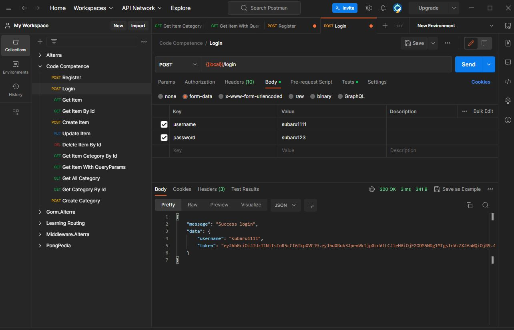

# **Code Competence**

## Kriteria

 

- Menggunakan jwt authentication untuk login
- Menggunakan UUID untuk id items

## Flow Penggunaan Route

 

1. User Register terlebih dahulu

   

2. Setelah Register User wajib melakukan login untuk mengakses routes yang sudah di sediakan

   

3. Setelah User mendapatkan token nya bisa mengakses routes _get all item_

   

4. Kemudian user juga bisa melihat item dengan id dengan routes _get item by uuid_

   

5. User juga bisa membuat item dengan routes _Create items_

   

6. User juga bisa mengupdate item dengan routes _Update Item_

   

7. User juga bisa menghapus item dengan routes _Delete Item_

   

8. User juga bisa melihat item berdasarkan Catergory Id dengan routes _get item by category id_

   

9. User juga bisa melihat item berdasarkan nama item dengan routes _get item name with queryparam_

   
